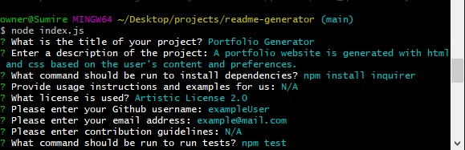

# README Generator
  ## Description
  A README.md file is generated based on the user's input. If a specific license out of MIT, Artistic 2.0, or PDDL are used, it will generate a badge and link to the chosen license. 

  ## Built With
  * Node.js
  * JavaScript

  ## Installation
  To install necessary dependencies, run the following command:

  ```npm install inquirer```

  ## Screenshot and Walkthrough
  
  
 [Walkthrough Video](https://watch.screencastify.com/v/Fj7fDm0OvXiGcauZbGyl)
  

  ## Questions
  If you have any additional questions, you can reach me via my [Github](https://github.com/coevpen). 
  
 

